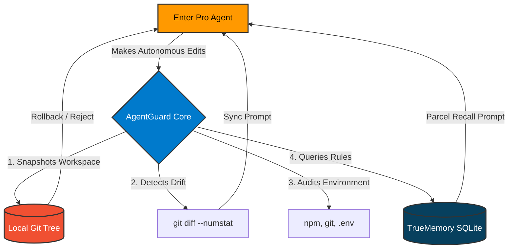

# 🛡️ AgentGuard — AI Coding Safety Layer


> **Quackathon Track 03 Submission** — Built in 48 hours using the Produck feedback loop on Enter Pro.

AgentGuard is a **VS Code extension** that gives developers visibility, control, and memory over AI coding agent sessions. It was designed and built based on **5 real friction points** captured via the Produck Chrome extension while using Enter Pro.

---

## 🎥 Demo Video
**[Watch the 2-minute Walkthrough on Google Drive](https://drive.google.com/file/d/1eDtXt9HHi5ztSz9OJiIKtuH4yFRrCKzC/view?usp=sharing)**

---

## 🦆 The Produck Loop

| Step | What we did |
|------|-------------|
| **Listen** | Used Enter Pro at `enter.converge.ai` and captured 5 friction points via the Produck Chrome extension |
| **Diagnose** | Connected to Produck MCP (`tryproduck.com/api/mcp`), called `search_feedback` to pull all 5 tickets with session context |
| **Decide** | Used the `user-alignment` skill from [tryproduck/produck-skills](https://github.com/paarth293/produck-skills) to generate a structured PRD |
| **Ship** | Built this VS Code extension implementing all 5 PRD features |

---

## 🔗 Related Submission Files

- 📋 [PRD.md](https://github.com/paarth293/produck-skills/blob/pr2/enter-pro-mockup/submissions/enter-pro/PRD.md)
- 🦆 [FEEDBACK.md](https://github.com/paarth293/produck-skills/blob/pr2/enter-pro-mockup/submissions/enter-pro/FEEDBACK.md)
- 🖥️ [High-Fidelity Mockup](https://github.com/paarth293/produck-skills/blob/pr2/enter-pro-mockup/submissions/enter-pro/mockup/index.html)
- 📦 [produck-skills fork (PR2)](https://github.com/paarth293/produck-skills/pull/11)

---

## 🛡️ The 5 Safety Fixes (Our Story)

### 🔴 The Shortcoming: No Rollback Feature (Destructive Edits)

**The Explanation:**
While using the Enter Pro, we(we are working in team of two) realized that the agent operates as a "Black Box". When we asked it to make changes into the code files, it makes a series of changes across the workspace. However, there was no undo button, no checkpoint history and no recovery path in the UI; to undo we have to give another instruction to the agent hence spending more tokens and taking more time.

**How We Found It:**
We were testing Enter Pro on a local project and realized we didn't like the architectural direction the agent took. We wanted to revert to the state from 10 minutes prior. The only way to go back was to spend more tokens and time asking the agent to "undo" its own work—spending more tokens. This marked as the first log into the Produck extension.

**The Solution We Built: Git-Backed Checkpoints**
To solve this, we built the Checkpoint & Rollback feature into AgentGuard. Before any agent session begins, AgentGuard takes a lightweight, labeled snapshot of the entire workspace. So if we have to rollback, we can easily using a single click.

**How We Reached the Solution:**
We knew that relying on the LLM to "undo" code was unreliable and expensive. We needed a deterministic solution. We designed AgentGuard to hook directly into the local Git tree. When the user clicks "Save Checkpoint", we create a temporary, hidden commit.

**How It Impacts Enter Pro:**
This completely eliminates the "fear factor" of using Enter Pro. Developers can now let the agent take massive, multi-file swings at complex problems. If the agent hallucinates or breaks the code, the developer can restore the exact previous state in under 3 seconds with a single click—saving tokens, time, and sanity.

---

### 🟡 The Shortcoming: Memory Desync (Stale Assumptions)

**The Explanation:**
Enter Pro assumes it is the only one touching the codebase. If a developer goes into the files and makes manual edits between agent sessions, the agent remains completely unaware of those changes. This causes a massive "memory desync" where the agent's internal context no longer matches the actual reality of the codebase.

**How We Found It:**
We were testing the agent's awareness by manually deleting a button from our code. In the next session, instead of realizing the button was gone, the agent acted as if it was still there. when asked to genearate the new code, it actually re-introduced the deleted button, completely overwriting our manual work and breaking the file. This marks as the second log into the Produck marking our next finding.

**The Solution We Built: Visual Memory Sync**
To solve this, we built the Memory Sync tab in AgentGuard. It actively detects if any files have been modified manually since the agent's last run, and flags them for the developer before the next session begins.

**How We Reached the Solution:**
We realized that git is the perfect source of truth. AgentGuard runs a background check (git diff --numstat) to compare the current workspace against the state the agent last saw. It lists the drifted files and provides a "Copy Sync Prompt" button, which generates a structured message telling the agent exactly what was manually altered so it can update its context.

**How It Impacts Enter Pro:**
It bridges the gap between human coding and AI coding. Developers no longer have to worry about the agent quietly undoing their manual bug fixes. By forcing the agent to sync its memory with the current reality of the code, we eliminate frustrating regressions and create a seamless handoff between developer and AI.

---

### 🟠 The Shortcoming: Forced Commits (No Staged Review)

**The Explanation:**
Currently, Enter Pro acts with complete autonomy—perhaps too much. When it finishes a coding task, it automatically saves and commits all its edits directly to the local files. There is no intermediate staging step to allow the developer to review the code, meaning we were forced to accept all changes blindly before we even know if they are correct.

**How We Found It:**
While watching the agent rewrite a complex component, we wanted to accept its changes to the UI styling but reject its changes to the backend logic. Because Enter Pro has no feature to selectively accept or reject edits, it permanently applied everything at once. This welcomes the third log into the Produck. 

**The Solution We Built: Diff Review (Per-file Accept/Reject)**
To solve this, we built the Diff Review panel into AgentGuard. Instead of the agent blindly committing everything, AgentGuard intercepts the changes and places them in a staging area for human review.

**How We Reached the Solution:**
We designed a UI that lists every file modified by the agent, showing exact +additions and -deletions. The developer can open a clean diff view for each file and explicitly click "Accept" to keep the changes or "Reject" to revert that specific file back to its previous state. We also added bulk "Accept All" and "Reject All" operations for speed.

**How It Impacts Enter Pro:**
It transforms the agent from an uncontrollable autonomous bot into a true pair programmer. The developer retains the ultimate authority over what code actually makes it into the permanent codebase, drastically reducing the chances of buggy AI code slipping into production.

---

### 🟢 The Shortcoming: Blind Workspace Trust (Environmental Decay)

**The Explanation:**
Enter Pro operates under the dangerous assumption that your project environment is perfectly healthy. It does not check if our dependencies are installed, if our git tree is clean, or if our environment variables are set before it starts writing code.

**How We Found It:**
We deliberately deleted some core dependencies and asked the agent to run the project. Instead of detecting that the workspace was broken, the agent blindly tried to execute the code. It wasted our time, our credits, and a full conversation turn on an entirely preventable dependency error. We marked this as the fourth log of our Produck extension. 

**The Solution We Built: Pre-Flight Health Check**
To solve this, we built a Workspace Health Check directly into AgentGuard. Before the agent touches a single file, the developer can run a rapid audit of the entire project foundation.

**How We Reached the Solution:**
We engineered a system that runs parallel background checks on git status, the node_modules folder, npm security vulnerabilities, and missing .env files. It compiles these checks into a visual gauge with a score from 0–100%, instantly warning the user if the environment is "At Risk" or "Degraded" before they spend any agent tokens.

**How It Impacts Enter Pro:**
It completely stops the agent from writing code on a broken foundation. By catching environmental decay before the agent runs, it saves developers from frustrating debugging loops, wasted API credits, and messy file errors.

---

### 🔵 The Shortcoming: No Long-Term Memory (Context Amnesia)

**The Explanation:**
Enter Pro sessions are completely stateless. Every time a developer starts a new chat or a new session, the agent's memory is wiped clean. It forgets user-defined preferences, specific architectural rules, and project-wide coding conventions, forcing the developer to re-teach the agent from scratch every single time.

**How We Found It:**
While iterating on our project, we realized we were wasting the first 5 to 10 minutes of every session just copy-pasting our preferred coding styles and rules back into the Enter Pro chat. The constant re-prompting was exhausting, and this "context amnesia" became our fifth and final log captured in Produck.

**The Solution We Built: Parcel Memory**
We knew one of the Quackathon sponsors, Parcel, specialized exactly in this: giving agents long-term memory. Since Enter Pro lacked this capability natively, we decided to build it ourselves. We created the Parcel Memory tab inside AgentGuard to give Enter Pro the permanent brain it was missing.

**How We Reached the Solution:**
We integrated Parcel’s underlying TrueMemory technology directly into our VS Code extension. We built a Python bridge that writes developer rules into a persistent local SQLite database (memories.db). Developers can add their strict coding guidelines once, and AgentGuard provides a "Copy Recall Prompt" button that instantly injects those rules into any new Enter Pro session.

**How It Impacts Enter Pro:**
It completely eliminates the repetitive task of re-teaching the AI. By leveraging Parcel's memory structure, Enter Pro finally remembers who the developer is and how they like to code across sessions, across projects, and even after restarting the computer.

---

## 🚀 How to Run

### Prerequisites
- VS Code
- Node.js 18+
- Python 3.9+ with `truememory` installed
- Git initialized in your workspace

### Setup
```bash
# 1. Clone this repo
git clone https://github.com/paarth293/AgentGuard.git
cd AgentGuard

# 2. Install dependencies
npm install

# 3. Install Python memory bridge dependencies
pip install truememory

# 4. Open in VS Code and press F5
# This launches the Extension Development Host
```

### Using AgentGuard
Once F5 is pressed, a new VS Code window opens (Extension Development Host). In that window:
1. Open any git repository folder
2. Click the **AgentGuard shield icon** in the sidebar
3. The full dashboard opens with 5 tabs

---

## 🏗️ Architecture



**System Components:**
- **`src/checkpoint.ts`**: Hooks into local Git for atomic state recovery.
- **`src/healthCheck.ts`**: Parallel subprocess executor for `npm` and `git` audits.
- **`src/diffReview.ts`**: Intercepts and parses git diffs for granular staging.
- **`src/memory.ts` & `src/memory_bridge.py`**: Cross-language bridge allowing the TypeScript extension to query the Parcel/TrueMemory Python SQLite database.

---

## 📁 Key Files

| File | Purpose |
|------|---------|
| [`src/extension.ts`](src/extension.ts) | Extension activation, command palette registration |
| [`src/checkpoint.ts`](src/checkpoint.ts) | Save/restore git-backed workspace snapshots |
| [`src/healthCheck.ts`](src/healthCheck.ts) | Pre-flight workspace health audit |
| [`src/memory.ts`](src/memory.ts) | Async TrueMemory DB interface |
| [`src/memory_bridge.py`](src/memory_bridge.py) | Python bridge for SQLite operations |
| [`app.js`](app.js) | Dashboard webview UI logic |
| [`index.html`](index.html) | Dashboard HTML structure |

---

## 🏆 Hackathon Context

Built for **Quackathon Track 03: Product — I can do it better**

- **Product tested:** Enter Pro (https://enter.converge.ai) — Quackathon sponsor
- **Feedback tool:** Produck Chrome extension + Produck MCP
- **Skill used:** `user-alignment` from `tryproduck/produck-skills`
- **PRs submitted:** [View on GitHub](https://github.com/paarth293/produck-skills)
